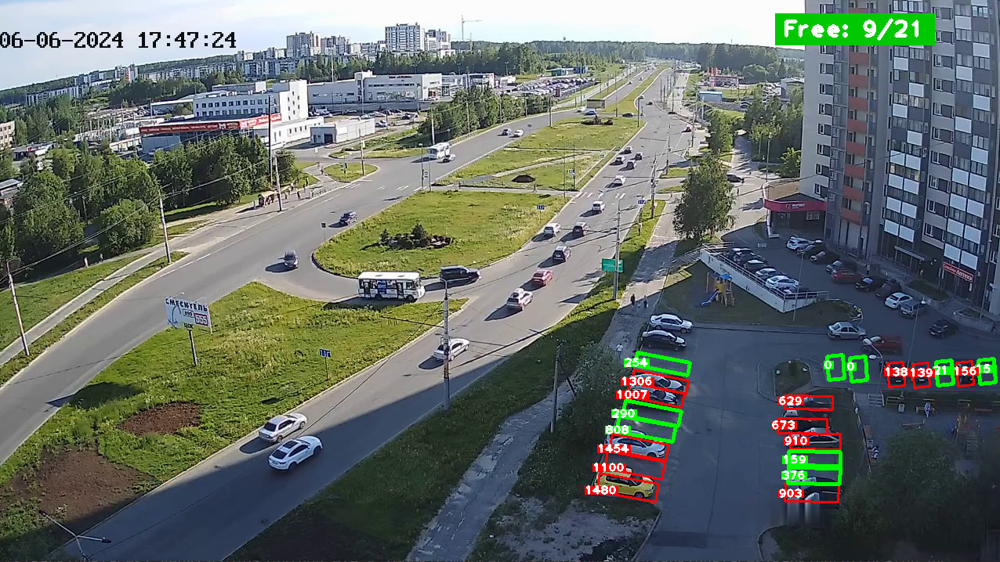

<div style="text-align: center">

# **Parking-Detector**


</div>

## Description

**Проект** основан на **компьютерном зрении** и функционирует без применения нейронных сетей, полагаясь на чистую **обработку изображений**. Было выбрано случайное видео с видеокамеры на парковке и проведена его разметка по правилам.

## Project structure
The project structure looks like this:
```python
PARKING-DETECTOR
│
├── materials/
│   ├── CarParkPositions
│   ├── Demonstration.jpg
│   ├── ParkPhoto.png
│   ├── ParkVideo.mp4
│   ├── Rules.jpg
├── tests/
│   ├── test_ParkLotLocat.py
│   ├── test_ParkPlacePick.py
├── ParkingLotLocator.py
├── ParkingPlacePicker.py
├── requirements.txt
```